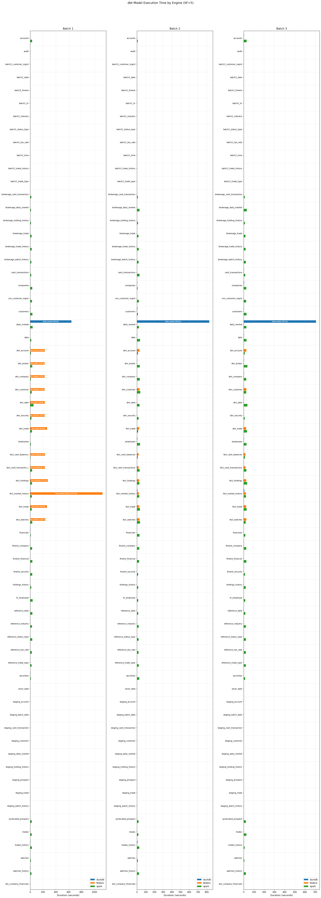

<!-- PROJECT LOGO -->
<p align="center">
  
  <h3 align="center">dbt - Incremental View Maintenance Benchmark</h3>
  <p align="center">
     Benchmarking engine-specific IVM implementations using a TPC-DI dbt project, <em>without</em> using <a href="https://docs.getdbt.com/docs/build/incremental-models">dbt incremental</a> (because watermark columns are unreliable).
     <br />
    <br />
    <a href="https://docs.getdbt.com/">dbt Docs</a>
    ·
    <a href="https://materializedview.io/p/everything-to-know-incremental-view-maintenance">Everything You Need to Know About Incremental View Maintenance</a>
    ·
    <a href="https://rakirahman.blob.core.windows.net/public/books/INCREMENTAL_VIEW_MAINTENANCE.pdf">Short doc on IVM</a>
    ·
    <a href="https://bit.ly/dbsp-paper-full">DBSP Paper</a>
    ·
    <a href="https://bit.ly/https://bit.ly/openivm-paper">OpenIVM Paper</a>
    <br />
    <br />
  </p>
</p>

<br>

Benchmarks Incremental View Maintenance capabilities on various Open Source engines with [the TPC-DI-based data model](https://www.tpc.org/tpcdi/) for **educational purposes**.

## Dev Setup

The only requirement is Docker.

See [`contrib/README.md`](contrib/README.md) on how to bootstrap a fresh Windows machine.

## Quickstart

### Benchmark

```bash
export GIT_ROOT=$(git rev-parse --show-toplevel)
export SCALE_FACTOR=5

sudo rm -rf ${GIT_ROOT}/mount/raw/${SCALE_FACTOR}
sudo rm -rf ${GIT_ROOT}/mount/results/${SCALE_FACTOR}
bash src/.scripts/benchmark.sh
```

Runs 3 batches per engine (Full load`batch1` → append `batch2` → append `batch3`).

### Engines

| Engine  | Compose file                           | Mode                 | Notes                                                                                                                                                                                         |
| ------- | -------------------------------------- | -------------------- | --------------------------------------------------------------------------------------------------------------------------------------------------------------------------------------------- |
| Spark   | `docker-compose.benchmark.spark.yml`   | Batch SQL            | Spark + MSSQL metastore                                                                                                                                                                       |
| DuckDB  | `docker-compose.benchmark.duckdb.yml`  | Batch SQL            | In-process, reads Delta via `delta` extension, writes via a hack with [this community extension](https://github.com/djouallah/delta_export) that blows up the Delta transaction log each time |
| Feldera | `docker-compose.benchmark.feldera.yml` | Streaming IVM (DBSP) | `pipeline-manager` + Delta input connectors                                                                                                                                                   |

## Mount layout

| Path                                                       | Description                                      |
| ---------------------------------------------------------- | ------------------------------------------------ |
| `mount/raw/<SF>/delta/batch{1,2,3}/`                       | Source Delta tables per batch                    |
| `mount/raw/<SF>/delta/staging/`                            | Unified staging (grows via `spark-batch-loader`) |
| `mount/results/<SF>/<engine>/`                             | Engine output (Delta tables from dbt)            |
| `mount/results/<SF>/dbt-server/run-<engine>-batch<N>.json` | Per-batch benchmark results                      |

## Results



---

## Disclaimer

As this repo's implementation of the TPC-DI is an unpublished and unofficial TPC Benchmark, the following is required legalese per TPC Fair Use Policy:

> The `ivm-bench` TPC-DI is derived from the TPC-DI source data to test Incremental View Maintenance and as such is NOT comparable to officially published TPC-DI results.
